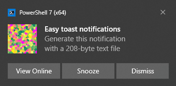

# LightlyToasted

Generate toast notifications on Windows 10 or 11 in a super-lightweight, language-agnostic way.  Just drop a text file into a directory, and the notification pops up!

## Introduction

The "toast" notifications that pop up on Windows are pretty useful when used right.  But generating them from your own code can be a bit painful, and needs some wrestling DLLs and language-specific bindings.

LightlyToasted is a PowerShell-based background task that allows toast notifications to be generated using one of the most straightforward and language-independent APIs there is: *writing a simple text file into a directory*.

## Quickstart

* [Quick installation guide](docs/quick_install.md)

* [Notification file format](docs/file_format.md)

* [Worked examples of notification features](docs/directives_detail.md)

## Features

* **Portable**: no need to install as an application or a PowerShell module, and no dependency on the Windows Registry.

* **Language-agnostic**: no need to know or write PowerShell – just generate text files from your own code in any language.

* Use local or remote **images** in notifications.

* Add buttons with **clickable links** to URLs or local files.

## Suggested uses

* If you write your own background scripts in Python, Go, Rust, or any language, use LightlyToasted to inform you when they're done or need your attention.

* This can include scripts running on headless servers: have them write a file, sync it to your Windows machine using [Syncthing](https://syncthing.net/), OneDrive, Google Drive etc, and the notification pops onto your desktop.

* On Android, use [Macrodroid](https://www.macrodroid.com/) to listen for events and write a text file, sync it across using [Syncthing](https://syncthing.net/), and you can get notifications on your desktop triggered by events on your phone.

* If you're distributing an app where toast notifications would be useful, please feel free to provide an integration to LightlyToasted, and encourage your users to install it.

* If you want to generate notifications from your own PowerShell app, then by all means you *can* use LightlyToasted – but it's worth taking a look at the richer PowerShell-native API provided in [BurntToast](https://github.com/Windos/BurntToast) by [Windos (Josh King)](https://github.com/Windos).  BurntToast is very easy to use from within a PowerShell script, and was super-useful to me in figuring out which DLLs were needed to get Windows to play ball.

## System requirements

* Windows 10 or 11.

* PowerShell 5 ("Windows PowerShell", the default in both Windows 10 and 11), or PowerShell 7 ("PowerShell Core").

* At installation time, the user needs sufficient permissions to create a scheduled task.

* If you're interested in forking or contributing to LightlyToasted (welcome), [Pester 5](https://pester.dev/) is needed to run the test suites.

## User manual

[LightlyToasted user manual](docs/toc.md)

## License

Licensed under the [MIT license](LICENSE.md).