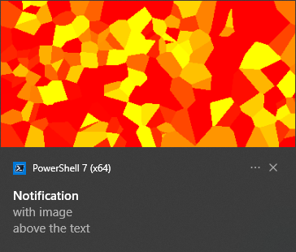

# Using directives

## Header and AttributionText <!--anchorinuse-->

The `Header` and `AttributionText` directives allow text to be rendered above and below the main body of the notification (so in total, you can get up to 5 lines of text: header, 3 lines of body text, and attribution).

| | |
|-|-|
| `\|Header: Header_text` `\|AttributionText: Brought to you by LightlyToasted` `Body text` `Some more body text` `A final line of body text` |  |

The header is also useful as a grouping key: notifications with the same app ID and header will appear together as a ["conversation"](https://docs.microsoft.com/en-us/windows/apps/design/shell/tiles-and-notifications/toast-headers).  This is particularly useful when there isn't a particular `SourceAppId` applicable to your script or app: you can let LightlyToasted default to using PowerShell's own app ID, and use headers to keep related notifications together.

## Scenario and Duration <!--anchorinuse-->

The `Duration` directive is quite straightforward: a value of `long` causes the notification to stay on screen for about 25 seconds before sliding back into the taskbar.  A value of `short` gives the same as the default behaviour (about 5 seconds).

`Scenario` in principle should give some finer-grained behaviour about whether the notification plays a sound, how it interacts with "Focus Assist" mode and so on.  As far as I can tell, the actual effects are quite limited: the only value that makes a difference is `incomingCall` will keep the notification indefinitely on screen until the user dismisses it and (on Windows 11) play a specific "phone call" sound.

I'm definitely interested in hearing if you get different behaviour on your Windows setup!

## Images

The `ImageSource` directive can be a full local path or a URL.  (For local files, you can use a `file://` URL if you like, but a normal Windows path works just as well.)

Note that to [use images from internet URLs](internet_images.md), it's necessary to **set `EnableWebImages` to `true` for the LightlyToasted background task**: either through a config JSON file or a command line option.

The `ImageAltText` directive specifies alt text for accessibility.

By default, the image appears as a small square to the left of the notification text.

| | |
|-|-|
| `\|ImageSource: D:\Images\img1.png` `\|ImageAltText: Example notification with square image to left of text` `Notification` `with square` `image to left` |  |

To crop it to a circle, include `|ImageCrop: circle`.

| | |
|-|-|
| `\|ImageSource: D:\Images\img1.png` `\|ImageCrop: circle` `\|ImageAltText: Example notification with circular image to left of text` `Notification` `with circular` `image to left` |  |

Alternatively, `ImagePlacement` allows the image to be placed below the text, or above it (a `hero` image in Microsoft's terminology).

| | |
|-|-|
| `\|ImageSource: D:\Images\imgrect.png` `\|ImagePlacement: hero` `\|ImageAltText: Example notification with image above text` `Notification` `with image` `above the text` |  |
| `\|ImageSource: D:\Images\imgrect.png` `\|ImagePlacement: below` `\|ImageAltText: Example notification with image below text` `Notification` `with image` `below the text` |  |

## Action buttons

Your notification can include any combination of the following:

* A **snooze** button that snoozes the notification for the system default time.
* A **dismiss** button that permanently dismisses the notification.
* Your own custom buttons which open **URLs** or **local files**:
    * URLs are opened with the default browser.
    * Local files are opened with the default app for the file's extension.  (Unfortunately if there is no default, Windows doesn't ask the user to choose an app: the action just fails silently.)

To include snooze and/or dismiss buttons, use the directives `|SnoozeButton` and `|DismissButton` respectively.

To include custom buttons, use pairs of directives: `|ButtonTarget1` and `|ButtonLabel1` for the first button; `|ButtonTarget2` and `|ButtonLabel2` and so on.

| | |
|-|-|
| `Notification` `with clickable buttons` `\|SnoozeButton` `\|DismissButton` `\|ButtonLabel1: Github` `\|ButtonTarget1: https://www.github.com` `\|ButtonLabel2: Logs` `\|ButtonTarget2: C:\Temp\LogsDir\logfile.txt`  |  |

## Source application ID

All Windows toast notifications are associated with an app: the app name and mini-icon appear at the top of the notification, and govern the grouping of notifications in the taskbar.  To be a fully capable "owner" of notifications, an app needs to have an [AppUserModelID](https://docs.microsoft.com/en-us/windows/win32/shell/appids).

LightlyToasted aims to be portable and not to touch the Windows Registry or Start Menu, so we don't get an AppUserModelID.  Instead, LightlyToasted by default uses the ID of the app that is guaranteed to exist on any system that can run LightlyToasted, i.e. PowerShell!

Although this means that all LightlyToasted notifications will by default be grouped under PowerShell in the taskbar, you can ensure that related notifications stay together in a common subgroup by giving their notifications the same header, [using the `|Header` directive](#header-and-attributiontext).

You can override the use of PowerShell's AppID by setting the `|SourceAppId` directive: either per notification, or by setting it as a default directive in the LightlyToasted config.  So if you're using LightlyToasted to send notifications from an app that has an AppUserModelID, you can use that and Windows will resolve it to an application name and icon.  (You can see the available AppUserModelIDs on the system using the Powershell cmdlet `Get-StartApps`.)

| | |
|-|-|
| `\|SourceAppId: Microsoft.Office.WINWORD.EXE.15` `\|ImageSource: https://bit.ly/3R1yaBN` `It looks like you're writing a letter` `Would you like help?` |  |

It is also possible to supply a free text string (not a valid AppUserModelID) as `|SourceAppId`.  In this case, the string you supply will be shown as the application on the notification.

| | |
|-|-|
| `\|SourceAppId: Some unregistered app` `\|ImageSource: D:\Images\img1.png` `Setting the SourceAppId` `to any string` `does "work", sometimes` |  |

**CAUTION: this is undocumented behaviour**, and seems to work only partially: some types of notification will silently fail to display.  For example, simple text-only notifications seem to work, but:

* Notifications with a header silently fail.
* Notifications with an image placement of `hero` or `below` silently fail.

