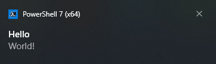

# Quick installation guide

1. Download the latest release .zip file, and unzip it to a directory of your choice.

2. Start a PowerShell session in that directory: you likely need to do this as an administrator, in order to create a scheduled task.

3. To set up LightlyToasted with the default settings, execute:

         ./Setup.ps1

   If PowerShell refuses to run the script because "running scripts is disabled" or because the script is not digitally signed, you'll need to adjust the [execution policy](https://docs.microsoft.com/powershell/module/microsoft.powershell.core/about/about_execution_policies) and unblock the files:

         Set-ExecutionPolicy -ExecutionPolicy RemoteSigned -Scope CurrentUser
         Get-ChildItem . -Recurse | Unblock-File

4. To generate a simple test notification, execute:

         "Hello`nWorld!" > ~/LightlyToasted/Inbox/test.toa
   
   You should see a notification like this:

   

5. LightlyToasted is now listening for new files (with the `.toa` extension) arriving in `~/LightlyToasted/Inbox` (where `~` is your `%userprofile%`). The background listening task will automatically start whenever you log on.

6. Read more about what you can do with LightlyToasted: [file formats](file_format.md) and [full user manual](toc.md)!